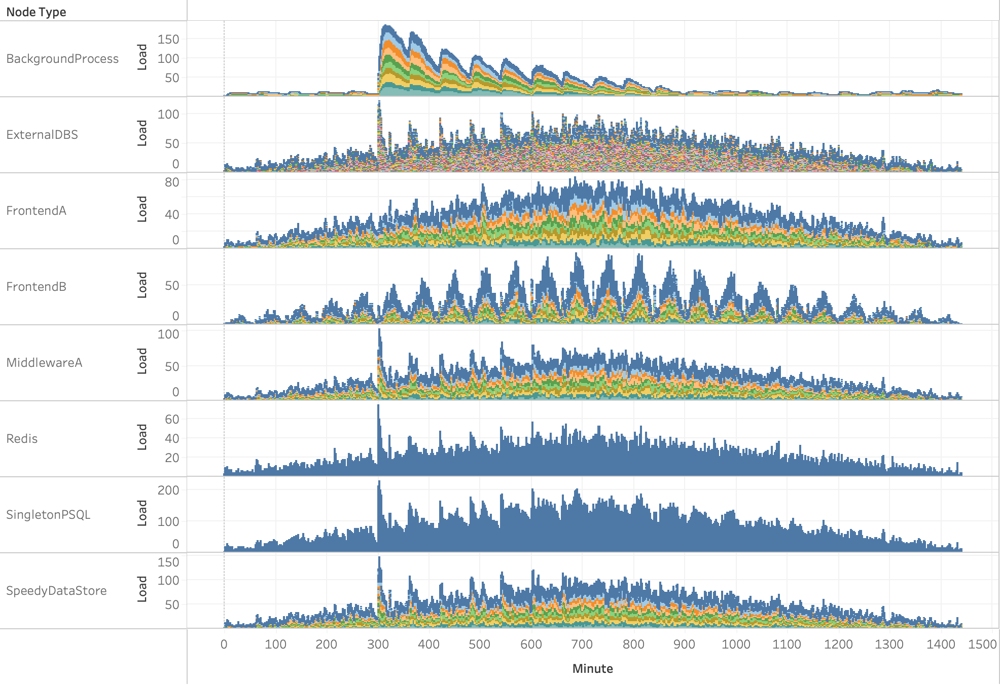

# (Not Much) Better Than Excel Distributed Systems Simulator

The (Not Much) Better Than Excel Distributed Systems Simulator fills a gap where precise simulation of a distributed system is too time consuming or expensive but making a bunch of stuff up on a whiteboard or in Excel is unseemly.

This can help illuminate choke points or issues in a fast and simple way to people inexperienced with the subtlities of the problems. It CANNOT help with correctness (this is not TLA+). It CANNOT help solve existing performance issues. It can help answer very simple what if questions.

This is currently one giant C++ file. The the appropriate encouragement I can make it all fancy-pants.

## Building
```
> mkdir build
> cd build
> cmake ../
> cmake --build .
```

This project uses rapidjson.

## Running

`> bte input.json output.csv`

The tool will print some output on it's configuration and then begin running the simulation. The csv file will contain data with the tick, node type, instance id of that node, and the current number of requests on that instance.

### Examples:
#### **example_ok.json** 
A cluster with some cycles in the dependencies which slowly ramps up load and then down. 

In the image below each node type is a row and the colors represent individual instances. The y axis is the number of current requests. When a large background operation occurs at around minute 300 we see that cascade through the cluster.

#### **example_degenerate.json** 
Same as example_ok.json but one of the common dependencies has been changed to have 1/10th the capacity. This simulation will not complete for a while, but you can stop it at any time.

Here the single instance of DataStoreC gets saturated; which results in the latency issues and requests building up across the cluster.


## Configuration

`ms_per_tick` is the number of milliseconds per simulation tick

`"drivers": [...]` is the set of node types which receive load from outside of the cluster

A node type is defined with an object such as

```
"NodeTypeA": {
        "instances": 10,          // number of this type
        "balanced": "content",    // load balancing across instances
        "growthmodel": "linear",  // capacity growth model
        "limit": 10,              // capacity limit
        "load": {                 // external load to generate per hour
            "requests": [...],
            "users"   : [...],
            "content" : [...],
            "sites"   : [...]
        },
        "cache": { "dist": "normal", "mean": 50, "stddev": 25 },
        "self_time": { "dist": "normal", "mean": 1000, "stddev": 250 },
        "network_latency": { "dist": "normal", "mean": 250, "stddev": 50 },
        "dependencies": {
            "NodeTypeB": { "dist": "normal", "mean": 50, "stddev": 10 },
            "NodeTypeC": { "dist": "normal", "mean": 50, "stddev": 10 },
        }
    }
```

* `instances` defines the number of instances of this node type
* `balanced` defines how requests are balanced across those instances. The options are `random`, `content`, `sites`, `users`
* `growthmodel` defines how capacity on an instance is regulated as load changes. Currently the options are simple `linear` and `logistic` models
* `limit` is used by the growth model to set the current capacity
* `load` is used by the load drivers within the cluster to define the requests and the maximum distinct users, content, and sites to generate per hour. Each of the requests is uniformly distributed between the hours. Each of these arrays should be of length 24 (for each hour of the day) and integers.
* `cache` defines the probability that the cache will be hit for a request. you specify a distribution (currently `uniform` or `normal`). Values need to be between 0-100.
* `self_time` defines the time spent servicing the request by the instance itself. It is specified in a distribution of milliseconds in either a `uniform` (with a `max` and `min`) or `normal` distribution (with `mean` and `stddev`.
* `network_latency` is similar to `self_time`, but cache hits will not impact it.
* `dependencies` is a list of node types this node depends on and the probability that a particular dependency will be used.


## Analyzing
The output of the csv can be used with the visualization tool of your choice. A Tableau workbook is provided to help (used above).

## Todo
* Network Timeouts
* Request Timeouts
* Random errors
* Better capacity growth models
* Non-uniform load generator