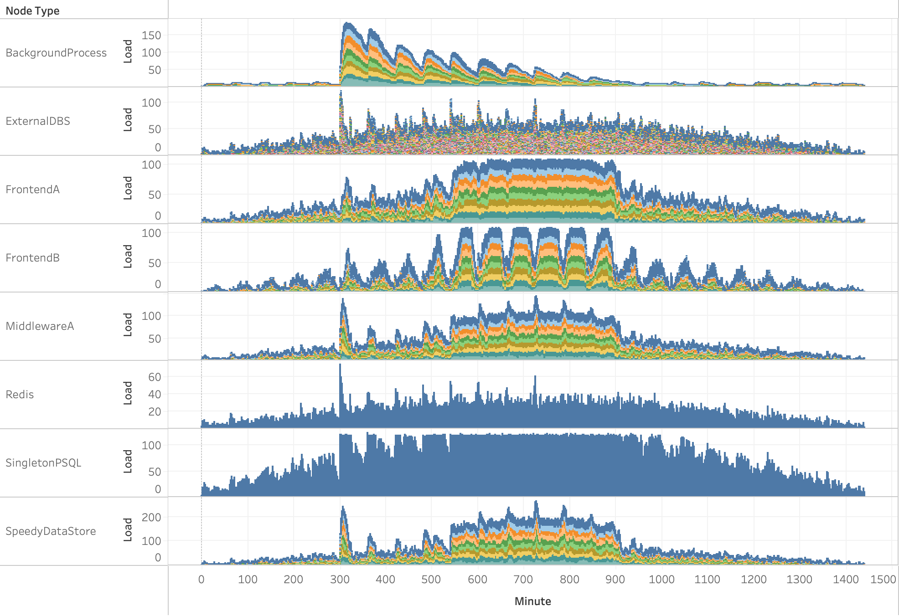

# (Not Much) Better Than Excel Distributed Systems Simulator

The (Not Much) Better Than Excel Distributed Systems Simulator fills a gap where precise simulation of a distributed system is too time consuming or expensive but making a bunch of stuff up on a whiteboard or in Excel is unseemly.

This can help illuminate choke points or issues in a fast and simple way to people inexperienced with the subtlities of the problems. It CANNOT help with correctness (this is not TLA+). It CANNOT help solve existing performance issues. It can help answer very simple what if questions.

## Building
```
> mkdir build
> cd build
> cmake ../
> cmake --build .
```

This project uses rapidjson.

## Running

`> bte input.json output.csv`

The tool will print some output on it's configuration and then begin running the simulation. The csv file will contain data with the tick, node type, instance id of that node, and the current number of requests on that instance.

### Examples:
Imagine the organically-grown, no preservatives cluster of something below. Why does the SpeedyDataStore talk to the Singleton PostgreSQL? No one knows; but it was the right decision at the time. All the load comes in through a background process and two different frontends. 


#### **example_ok.json** 
A cluster with some cycles in the dependencies which slowly ramps up load and then down. The Background jobs have a geometric distribution on the hour; meaning that most of the jobs are started within the first 15 minutes. Frontend A has a uniform load distribution coming in but Frontend B has a normal distribution.

Each node type has different latencies, self-time latencies, timeouts and cache hit rates.

In the image below each node type is a row and the colors represent individual instances. The y axis is the number of current requests. When a large background operation occurs at around minute 300 we see that cascade through the cluster.

#### **example_degenerate.json** 
Same as example_ok.json but we cut the capacity of the SingletonPSQL by hal f which gets saturated; which results in the latency issues and requests building up across the cluster.



## Configuration

`ms_per_tick` is the number of milliseconds per simulation tick

`"drivers": [...]` is the set of node types which receive load from outside of the cluster

A node type is defined with an object such as

```
"NodeTypeA": {
        "instances": 10,          // number of this type
        "timeout": 10000,          // request timeout in ms
        "balanced": "content",    // load balancing across instances
        "growthmodel": "linear",  // capacity growth model
        "limit": 10,              // capacity limit
        "load": {                 // external load to generate per hour
        	  "distribution": "geometric",  // distribution within hour
            "requests": [...],    // number of requests per hour
            "users"   : [...],    // maximum number of users in hour
            "content" : [...],    // max "content" per hour
            "sites"   : [...].    // max "sites" per hour
        },
        "cache": { "dist": "normal", "mean": 50, "stddev": 25 },
        "self_time": { "dist": "uniform", "min": 10, "max": 250 },
        "network_latency": { "dist": "geometric", "prob": 0.05},
        "dependencies": {
            "NodeTypeB": { "dist": "normal", "mean": 50, "stddev": 10 },
            "NodeTypeC": { "dist": "normal", "mean": 50, "stddev": 10 },
        }
    }
```

* `instances` defines the number of instances of this node type
* `timeout` defines the timeout of requests on an instance, in ms
* `balanced` defines how requests are balanced across those instances. The options are `random`, `content`, `sites`, `users`
* `growthmodel` defines how capacity on an instance is regulated as load changes. Currently the options are simple `linear` and `logistic` models
* `limit` is used by the growth model to set the current capacity
* `load` is used by the load drivers within the cluster to define the requests and the maximum distinct users, content, and sites to generate per hour. Each of these arrays should be of length 24 (for each hour of the day) and integers. 
	* **Distribution:** You must specify how the load is distributed throughout the hour. The parameterization of these distributions is fixed. The choices are:
		*  `geometric` where most load is distributed at the start of the hour
		*  `uniform` where it is distributed uniformly throughout the hour
		*  `normal` which is a normal distribution around the 30 minute mark.  
	* The integers in the array are related by `sites < users < content < requests`
* `cache` defines the probability that the cache will be hit for a request. you specify a distribution (`uniform` or `normal`). A value above 50 will use the cache, so the distributions should be sensibly configured to fall within this range.
* `self_time` defines the time spent servicing the request by the instance itself. It is specified in a distribution of milliseconds in either a `uniform` or `normal` distribution  or `geometric`.
* `network_latency` is similar to `self_time`, but cache hits will not impact it.
* `dependencies` is a list of node types this node depends on and the probability that a particular dependency will be used.

### A note on distributions
The std c++ [libraries ](https://www.cplusplus.com/reference/random/normal_distribution/)are used to generate the distributions. Some care should be used to pick distributions that may sense and that the parameters are correct. For load distribution within an hour, "normally" distributed load generation make very little sense, but a "geometrically" decreasing load makes sense for jobs which often start on the hour.

* `uniform` only uses the parameters `max` and `min`
* `normal` uses the parameters `mean` and `stddev`
* `geometric` uses `prob` which is the probability of each trial

## Analyzing
The output of the csv can be used with the visualization tool of your choice. A Tableau workbook is provided to help (used above).

## Todo
* Random errors
* Better capacity growth models